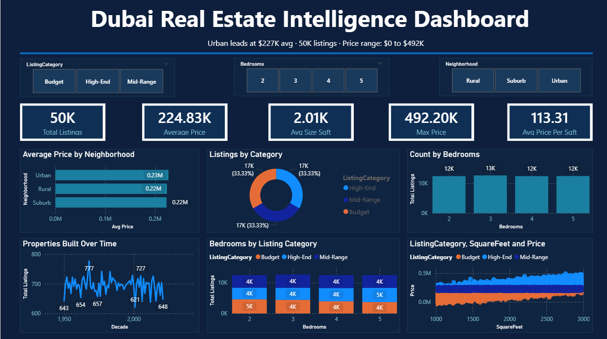

# 🏙️ Dubai Real Estate Intelligence Dashboard

<div align="center">


**An end-to-end interactive real estate analytics dashboard built with Microsoft Power BI,
analyzing 50,000 property listings across Urban, Suburban, and Rural neighborhoods.**

</div>

---

## 📸 Dashboard Preview

> *Full interactive dashboard with dark navy theme, KPI cards, and cross-filtering slicers*



---

## 📌 Project Overview

This project was developed as part of an internship assignment focused on real-world
data analytics and business intelligence. The goal was to transform a raw housing
dataset into a fully interactive, insight-driven Power BI dashboard that enables
real estate investors, agents, and analysts to explore property market trends
through dynamic visualizations.

| Detail | Info |
|---|---|
| 🛠️ Tool | Microsoft Power BI Desktop |
| 📁 Dataset | 50,000 Housing Property Records |
| 🏘️ Neighborhoods | Urban · Suburb · Rural |
| 📅 Year Range | 1950 – 2021 |
| 🎯 Project Type | Internship Data Analytics Project |

---

## 🎯 Business Questions Answered

- 🔹 Which neighborhood commands the highest average property price?
- 🔹 How does property size (sq ft) correlate with selling price?
- 🔹 What is the market distribution across Budget, Mid-Range, and High-End listings?
- 🔹 How has construction activity trended across decades?
- 🔹 Which bedroom configurations are most common in this market?

---

## 📊 Dataset Description

### Original Columns

| Column | Description | Type |
|---|---|---|
| `SquareFeet` | Total area of the property | Integer |
| `Bedrooms` | Number of bedrooms (2–5) | Integer |
| `Bathrooms` | Number of bathrooms | Integer |
| `Neighborhood` | Area type — Urban / Suburb / Rural | String |
| `YearBuilt` | Year of construction (1950–2021) | Integer |
| `Price` | Selling price of the property | Float |

### Engineered Columns (Added during Data Preparation)

| Column | Formula | Purpose |
|---|---|---|
| `PricePerSqft` | `Price ÷ SquareFeet` | Fair size-adjusted price comparison |
| `PropertyAge` | `2025 - YearBuilt` | Measure how old the property is |
| `ListingCategory` | Based on price quantiles | Segment into Budget / Mid-Range / High-End |

---

## 🧮 DAX Measures Created

```dax
Total Listings = COUNTROWS('enriched_housing')

Avg Price = AVERAGE('enriched_housing'[Price])

Avg Price Per Sqft = AVERAGE('enriched_housing'[PricePerSqft])

Max Price = MAX('enriched_housing'[Price])

Avg Size Sqft = AVERAGE('enriched_housing'[SquareFeet])
```

---

## 📈 Dashboard Visuals

| Visual | Type | Insight |
|---|---|---|
| KPI Cards (×5) | Card | Total listings, Avg price, Max price, Size, Price/sqft |
| Avg Price by Neighborhood | Horizontal Bar Chart | Urban leads at $227K |
| Listings by Category | Donut Chart | Equal 33.3% split across all categories |
| Count by Bedrooms | Column Chart | 3 BHK most common at 12,661 listings |
| Properties Built Over Time | Line Chart | Peak construction in 1960s–1990s |
| Size vs Price | Scatter Plot | Strong positive correlation by category |
| Neighborhood × Category | Tree Map | Visual breakdown by area and price tier |
| Bedrooms by Category | Stacked Column Chart | Category distribution within each bedroom type |

### 🎛️ Interactive Slicers
- **Listing Category** — Budget / Mid-Range / High-End
- **Bedrooms** — 2 / 3 / 4 / 5 BHK
- **Neighborhood** — Urban / Suburb / Rural

---

## 💡 Key Insights

> **01 · Urban Leads Pricing**
> Urban properties average $227K — 2% above the overall market average of $224K,
> making them the premium segment for investors seeking high returns.

> **02 · Size Drives Value**
> A strong positive correlation exists between SquareFeet and Price.
> Larger homes consistently command higher prices across all neighborhood types.

> **03 · Balanced Market Segments**
> Budget, Mid-Range, and High-End listings each account for exactly 33.3%
> of all 50,000 properties — indicating a well-diversified, balanced market.

> **04 · Peak Construction Era: 1960s–1990s**
> Construction activity peaked during the 1960s–1990s with 6,800–7,000
> properties per decade. Post-2010 activity shows a sharp decline.

---

## 📁 Repository Structure

```
dubai-real-estate-dashboard/
│
├── 📊 Dubai_House_Dashboard.pbix       # Main Power BI Dashboard file
├── 📄 enriched_housing.csv             # Cleaned & enriched dataset
├── 📑 Dubai_Dashboard_Summary.pptx     # 1-slide executive summary
├── 📋 README.md                        # Project documentation
│
└── 📂 assets/
    └── dashboard_preview.png           # Dashboard screenshot
```

---

## 🚀 How to Run This Project

### Prerequisites
- Microsoft Power BI Desktop (free download from [powerbi.microsoft.com](https://powerbi.microsoft.com))

### Steps

**1. Clone this repository**
```bash
git clone https://github.com/your-username/dubai-real-estate-dashboard.git
cd dubai-real-estate-dashboard
```

**2. Open the dashboard**
```
Open Dubai_House_Dashboard.pbix in Power BI Desktop
```

**3. Refresh data (if needed)**
```
Home → Refresh
```

**4. Explore the dashboard**
- Use the slicers to filter by Category, Bedrooms, or Neighborhood
- Hover over charts for detailed tooltips
- Click any chart element to cross-filter the entire dashboard

---

## 🛠️ Tools & Technologies

| Tool | Purpose |
|---|---|
| Microsoft Power BI Desktop | Dashboard creation & data modeling |
| Power Query Editor | Data cleaning & transformation |
| DAX (Data Analysis Expressions) | Custom measures & calculations |
| Python (pandas) | Initial data enrichment & column engineering |
| Microsoft PowerPoint | Executive summary slide |

---

## 📬 Contact

**If you have any questions about this project, feel free to reach out!**

[](https://github.com/Akchauhan262)
[](https://linkedin.com/in/your-profile)

---

<div align="center">

⭐ **If you found this project useful, please consider giving it a star!** ⭐

*Built with 💙 using Microsoft Power BI*

</div>
